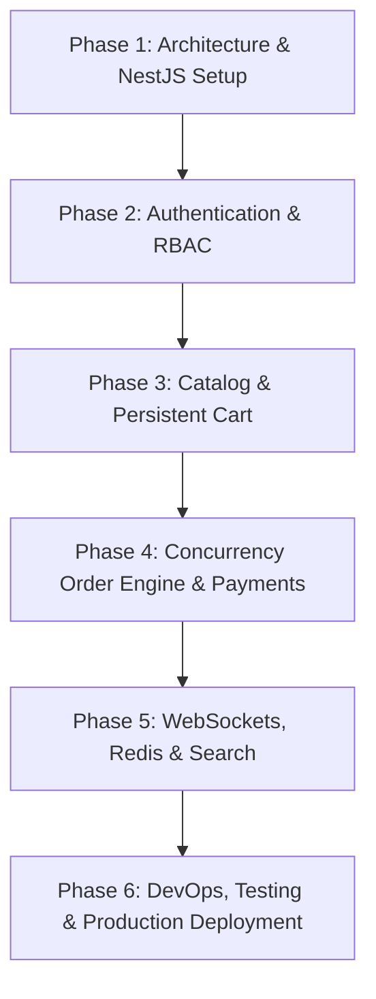

# 🗺️ FreshCart — Production-Grade NestJS + Prisma + PostgreSQL Architecture & Future Roadmap

This document outlines the blueprint, architectural roadmap, and feature checklist required to transform **FreshCart** from its current Next.js full-stack foundation into an enterprise-grade, high-performance, and production-ready e-commerce platform powered by a decoupled **NestJS** backend, **Prisma ORM**, and **PostgreSQL**.

---

## 📐 1. System Architecture Overview

Transitioning to a decoupled, microservice-friendly architecture ensures scalability, high availability, strict security boundaries, and modular development.

```
                     ┌────────────────────────────────────────┐
                     │          Next.js 16 Frontend           │
                     │  (App Router, React 19, Server Components) │
                     └───────────────────┬────────────────────┘
                                         │ HTTPS / REST / WebSockets
                                         ▼
                     ┌────────────────────────────────────────┐
                     │            API Gateway / Nginx         │
                     │        (SSL Termination, Rate Limiting) │
                     └───────────────────┬────────────────────┘
                                         │
                                         ▼
                     ┌────────────────────────────────────────┐
                     │             NestJS Backend             │
                     │  (Controllers, Services, DTOs, Guards)  │
                     └──────┬────────────┬─────────────┬──────┘
                            │            │             │
        ┌───────────────────┘            │             └───────────────────┐
        ▼                                ▼                                 ▼
┌──────────────┐                 ┌──────────────┐                  ┌──────────────┐
│  PostgreSQL  │                 │    Redis     │                  │  Meilisearch │
│  (Main DB)   │                 │ (Cache/Queue)│                  │(Product Search)│
└──────────────┘                 └──────────────┘                  └──────────────┘
```

---

## 🛠️ 2. Core Tech Stack for Production

| Component | Technology | Purpose & Rationale |
| :--- | :--- | :--- |
| **Frontend** | Next.js 16 (App Router) + React 19 | Fast SSR/SSG rendering, SEO optimization, responsive UI |
| **State Management** | Zustand + React Query (TanStack Query) | Server-state caching, optimistic cart updates, sync with backend |
| **Backend Framework**| NestJS (Node.js/TypeScript) | Enterprise structure, Dependency Injection, modular architecture |
| **Database** | PostgreSQL 16+ | ACID-compliant relational data, JSONB support for metadata |
| **ORM** | Prisma ORM (v7+) | Type-safe query building, migration management, high performance |
| **Cache & Queue** | Redis + BullMQ | Session cache, inventory lock, rate limiting, async job processing |
| **Search Engine** | Meilisearch / Elasticsearch | Instant fuzzy full-text search, multi-facet filtering, auto-complete |
| **Real-time Engine**| WebSockets (`@nestjs/websockets`) | Live driver tracking, instant order status push updates |
| **Storage / CDN** | AWS S3 / Cloudflare R2 | Scalable media assets storage (product images, invoice PDFs) |
| **Payments** | Stripe / SSLCommerz / PayPal | Secure payment checkout, webhook transaction sync, idempotency |

---

## 🗄️ 3. Production Prisma Database Schema Design

Below is the extended production schema model to be configured in `prisma/schema.prisma`:

```prisma
// User & Authentication Models
model User {
  id            String         @id @default(uuid())
  email         String         @unique
  passwordHash  String
  name          String
  phone         String?
  role          Role           @default(CUSTOMER)
  isActive      Boolean        @default(true)
  emailVerified Boolean        @default(false)
  avatarUrl     String?
  createdAt     DateTime       @default(now())
  updatedAt     DateTime       @updatedAt
  
  addresses     Address[]
  orders        Order[]
  cart          Cart?
  reviews       Review[]
  wishlist      Wishlist[]
  auditLogs     AuditLog[]

  @@map("users")
}

enum Role {
  CUSTOMER
  ADMIN
  MANAGER
  DELIVERY_AGENT
  VENDOR
}

model Address {
  id           String      @id @default(uuid())
  userId       String
  user         User        @relation(fields: [userId], references: [id], onDelete: Cascade)
  addressLine1 String
  addressLine2 String?
  city         String
  state        String
  postalCode   String
  country      String
  isDefault    Boolean     @default(false)
  type         AddressType @default(SHIPPING)

  @@map("addresses")
}

enum AddressType {
  SHIPPING
  BILLING
}

// Product & Inventory Catalog
model Category {
  id          String        @id @default(uuid())
  name        String        @unique
  slug        String        @unique
  description String?
  imageUrl    String?
  parentId    String?
  parent      Category?     @relation("CategoryToSubcategory", fields: [parentId], references: [id])
  children    Category[]    @relation("CategoryToSubcategory")
  products    Product[]
  createdAt   DateTime      @default(now())

  @@map("categories")
}

model Product {
  id          String          @id @default(uuid())
  name        String
  slug        String          @unique
  description String
  unit        String          // e.g., "kg", "pack", "500g"
  price       Decimal         @db.Decimal(10, 2)
  discountPrice Decimal?      @db.Decimal(10, 2)
  isOrganic   Boolean         @default(true)
  isAvailable Boolean         @default(true)
  ratingAvg   Float           @default(0.0)
  ratingCount Int             @default(0)
  categoryId  String
  category    Category        @relation(fields: [categoryId], references: [id])
  images      ProductImage[]
  inventory   Inventory?
  orderItems  OrderItem[]
  cartItems   CartItem[]
  reviews     Review[]
  wishlists   Wishlist[]
  createdAt   DateTime        @default(now())
  updatedAt   DateTime        @updatedAt

  @@index([categoryId])
  @@index([slug])
  @@map("products")
}

model ProductImage {
  id        String   @id @default(uuid())
  productId String
  product   Product  @relation(fields: [productId], references: [id], onDelete: Cascade)
  url       String
  isPrimary Boolean  @default(false)

  @@map("product_images")
}

model Inventory {
  id          String   @id @default(uuid())
  productId   String   @unique
  product     Product  @relation(fields: [productId], references: [id], onDelete: Cascade)
  stock       Int      @default(0)
  reserved    Int      @default(0) // Locked stock during active checkout
  lowStockAlert Int    @default(10)
  updatedAt   DateTime @updatedAt

  @@map("inventories")
}

// Persistent Cart System
model Cart {
  id        String     @id @default(uuid())
  userId    String?    @unique
  user      User?      @relation(fields: [userId], references: [id], onDelete: Cascade)
  items     CartItem[]
  createdAt DateTime   @default(now())
  updatedAt DateTime   @updatedAt

  @@map("carts")
}

model CartItem {
  id        String   @id @default(uuid())
  cartId    String
  cart      Cart     @relation(fields: [cartId], references: [id], onDelete: Cascade)
  productId String
  product   Product  @relation(fields: [productId], references: [id])
  quantity  Int      @default(1)

  @@unique([cartId, productId])
  @@map("cart_items")
}

// Order & Checkout Workflow
model Order {
  id             String          @id @default(uuid())
  orderNumber    String          @unique
  userId         String
  user           User            @relation(fields: [userId], references: [id])
  subtotal       Decimal         @db.Decimal(10, 2)
  deliveryFee    Decimal         @db.Decimal(10, 2)
  discountAmount Decimal         @default(0.00) @db.Decimal(10, 2)
  totalAmount    Decimal         @db.Decimal(10, 2)
  status         OrderStatus     @default(PENDING)
  paymentStatus  PaymentStatus   @default(UNPAID)
  paymentMethod  String
  shippingInfo   Json            // Snapshot of address at time of purchase
  createdAt      DateTime        @default(now())
  updatedAt      DateTime        @updatedAt

  items          OrderItem[]
  transactions   PaymentTransaction[]
  statusHistory  OrderStatusHistory[]

  @@index([userId])
  @@index([orderNumber])
  @@map("orders")
}

enum OrderStatus {
  PENDING
  CONFIRMED
  PROCESSING
  SHIPPED
  OUT_FOR_DELIVERY
  DELIVERED
  CANCELLED
  REFUNDED
}

enum PaymentStatus {
  UNPAID
  PAID
  FAILED
  REFUNDED
}

model OrderItem {
  id        String   @id @default(uuid())
  orderId   String
  order     Order    @relation(fields: [orderId], references: [id], onDelete: Cascade)
  productId String
  product   Product  @relation(fields: [productId], references: [id])
  quantity  Int
  unitPrice Decimal  @db.Decimal(10, 2)
  total     Decimal  @db.Decimal(10, 2)

  @@map("order_items")
}

model OrderStatusHistory {
  id        String      @id @default(uuid())
  orderId   String
  order     Order       @relation(fields: [orderId], references: [id], onDelete: Cascade)
  status    OrderStatus
  note      String?
  changedBy String?
  createdAt DateTime    @default(now())

  @@map("order_status_history")
}

model PaymentTransaction {
  id            String        @id @default(uuid())
  orderId       String
  order         Order         @relation(fields: [orderId], references: [id])
  transactionId String        @unique
  provider      String        // Stripe, PayPal, SSLCommerz
  amount        Decimal       @db.Decimal(10, 2)
  status        PaymentStatus
  rawPayload    Json?
  createdAt     DateTime      @default(now())

  @@map("payment_transactions")
}

model Review {
  id        String   @id @default(uuid())
  productId String
  product   Product  @relation(fields: [productId], references: [id], onDelete: Cascade)
  userId    String
  user      User     @relation(fields: [userId], references: [id], onDelete: Cascade)
  rating    Int
  comment   String?
  createdAt DateTime @default(now())

  @@map("reviews")
}

model Wishlist {
  id        String   @id @default(uuid())
  userId    String
  user      User     @relation(fields: [userId], references: [id], onDelete: Cascade)
  productId String
  product   Product  @relation(fields: [productId], references: [id], onDelete: Cascade)
  createdAt DateTime @default(now())

  @@unique([userId, productId])
  @@map("wishlists")
}

model AuditLog {
  id        String   @id @default(uuid())
  userId    String?
  user      User?    @relation(fields: [userId], references: [id])
  action    String   // e.g. "PRODUCT_CREATED", "ORDER_CANCELLED"
  details   Json
  ipAddress String?
  createdAt DateTime @default(now())

  @@map("audit_logs")
}
```

---

## 🏗️ 4. NestJS Backend Architecture & Modules

The NestJS backend will be structured into domain-driven modules:

```text
fresh-cart-backend/
├── src/
│   ├── app.module.ts
│   ├── main.ts
│   ├── modules/
│   │   ├── auth/             # JWT, OAuth, Passwords, RBAC Guards
│   │   ├── users/            # User profile management, address CRUD
│   │   ├── products/         # Catalog CRUD, Category management, Image upload
│   │   ├── inventory/        # Stock lock, low stock warnings, batch updates
│   │   ├── cart/             # Guest to user cart merging, item persistence
│   │   ├── orders/           # Order placement, status state machine, invoices
│   │   ├── payments/         # Payment gateways, webhook receivers, idempotency
│   │   ├── notifications/    # WebSocket Gateway, Email templates (Resend), SMS
│   │   ├── search/           # Meilisearch / Elasticsearch synchronization
│   │   └── analytics/        # Sales metrics, aggregate queries, revenue charts
│   ├── common/
│   │   ├── decorators/       # @CurrentUser(), @Roles(), @Public()
│   │   ├── filters/          # AllExceptionsFilter, PrismaClientExceptionFilter
│   │   ├── guards/           # JwtAuthGuard, RolesGuard, ThrottlerGuard
│   │   ├── interceptors/     # LoggingInterceptor, TransformInterceptor
│   │   └── pipes/            # ValidationPipe (Zod / Class-Validator)
│   └── prisma/
│       ├── prisma.module.ts  # Global Prisma Service integration
│       └── prisma.service.ts
```

---

## ✨ 5. Key Production Features To Implement

### 1. 🛡️ Advanced Security & Authentication
- **JWT Refresh Token Rotation**: Store hashed refresh tokens in Redis / PostgreSQL with single-use rotation to mitigate token theft.
- **Role-Based Access Control (RBAC)**: Enforce `@Roles(Role.ADMIN, Role.MANAGER)` across administrative endpoints.
- **Rate Limiting & Throttling**: Use `@nestjs/throttler` backed by Redis to prevent brute-force attacks and DDOS on `/api/v1/auth/login` and checkout APIs.
- **Input Validation & Sanitization**: Strict DTO validation with `class-validator` and `class-transformer` to strip unexpected parameters.

### 2. ⚡ Concurrency & Inventory Lock Management
- **Optimistic Concurrency Control**: Prevent overselling popular organic products during flash sales using atomic database updates or Redis distributed locks (`Redlock`).
- **Stock Reservation**: Temporarily reserve items when a customer enters checkout for 15 minutes before releasing them if unpaid.

### 3. 💳 Resilient Payment Processing & Webhooks
- **Idempotency Keys**: Guarantee that double-clicks or repeated network requests never trigger duplicate charges.
- **Webhook Handlers**: Validate cryptographic signatures on incoming webhooks from Stripe or payment providers and use database transactions for atomic state mutation.

### 4. 📡 Real-Time Live Order & Driver Tracking
- **NestJS WebSocket Gateway**: Push instant order status transitions (`PENDING` ➔ `CONFIRMED` ➔ `SHIPPED` ➔ `DELIVERED`) directly to the Next.js client UI.
- **Live Delivery Coordinates**: Allow delivery agents to transmit GPS updates to active customer order tracking screens.

### 5. 🔍 High-Performance Search & Autocomplete
- **Full-Text & Fuzzy Search**: Integrate Meilisearch for instant search results as users type, supporting typo tolerance, category filters, and price ranges.
- **Automated Sync**: Synchronize database changes to the search index via Prisma middleware or BullMQ jobs.

### 6. 📊 Real-Time Analytics & Aggregation Engine
- **Dashboard APIs**: High-speed analytics queries for monthly revenue, daily volume, average order value (AOV), and customer retention rates.
- **Export Reports**: Generate CSV / PDF sales summaries for store managers using background worker jobs.

### 7. 🛒 Guest-to-User Cart Synchronization
- **Seamless Cart Merging**: Store guest cart items in `localStorage` or HTTP-only cookie, and merge automatically into the server-side database cart when the user logs in.

---

## 🚀 6. DevOps, Infrastructure & Quality Assurance

### 🐳 Docker & Containerization
Create a `docker-compose.yml` for local development and staging environments:

```yaml
version: '3.8'

services:
  postgres:
    image: postgres:16-alpine
    container_name: freshcart_postgres
    environment:
      POSTGRES_USER: freshcart
      POSTGRES_PASSWORD: secretpassword
      POSTGRES_DB: freshcart_db
    ports:
      - "5432:5432"
    volumes:
      - postgres_data:/var/lib/postgresql/data

  redis:
    image: redis:7-alpine
    container_name: freshcart_redis
    ports:
      - "6379:6379"

  meilisearch:
    image: getmeili/meilisearch:latest
    container_name: freshcart_search
    environment:
      MEILI_MASTER_KEY: masterKey123
    ports:
      - "7700:7700"

volumes:
  postgres_data:
```

### 🧪 Automated Testing Strategy
- **Unit Tests**: Jest tests for NestJS services and business logic validation.
- **E2E Integration Tests**: Supertest suite testing HTTP endpoints, authentication guards, and database transactions.
- **Frontend UI Tests**: Playwright / Cypress tests for the Next.js cart checkout flow.

### 📈 Monitoring, Logging & Observability
- **Structured JSON Logging**: Pino logger for structured, searchable log records.
- **Error Tracking**: Integration with Sentry for real-time exception notifications.
- **API Documentation**: Automated OpenAPI / Swagger UI hosted at `/api/docs`.

---

## 🗓️ 7. Phased Implementation Roadmap



### Phase 1: Architecture & NestJS Setup
- [ ] Initialize NestJS backend project (`nest new fresh-cart-backend`).
- [ ] Setup Prisma ORM 7 with PostgreSQL connection pooling.
- [ ] Implement global filters, interceptors, and Swagger API documentation.

### Phase 2: Authentication & User Management
- [ ] Implement JWT Access & Refresh Token strategy.
- [ ] Set up Password hashing (Argon2 / Bcrypt) and OAuth 2.0.
- [ ] Build RBAC Guards (`@Roles('ADMIN', 'CUSTOMER')`).

### Phase 3: Catalog & Cart Engine
- [ ] Implement Product, Category, and Inventory NestJS modules.
- [ ] Create database-backed persistent cart with guest cart merging endpoint.
- [ ] Integrate image upload via AWS S3 / Cloudflare R2.

### Phase 4: Order & Payment Processing
- [ ] Build transactional order placement service with atomic inventory deduction.
- [ ] Integrate Stripe / payment webhooks with idempotency keys.
- [ ] Implement order status state machine.

### Phase 5: Advanced Real-Time & Search Features
- [ ] Add NestJS WebSocket Gateway for live order tracking notifications.
- [ ] Configure Redis for API caching and BullMQ background queues.
- [ ] Integrate Meilisearch for instant search and filtering.

### Phase 6: Production Deployment & Observability
- [ ] Configure Docker containerization and Docker Compose.
- [ ] Set up CI/CD pipeline with GitHub Actions.
- [ ] Deploy NestJS backend (AWS ECS / Railway / DigitalOcean) and Next.js frontend (Vercel).
- [ ] Enable Sentry exception tracking and Datadog/Pino APM logging.

---

*This roadmap serves as the definitive reference for converting FreshCart into an enterprise production-grade application.*
